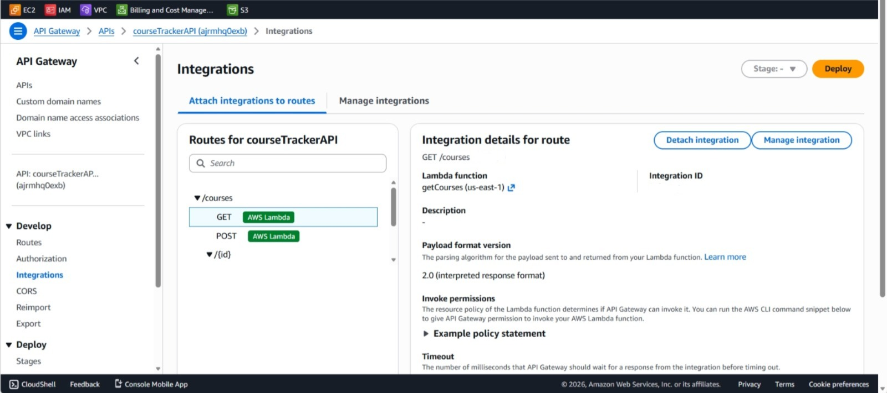
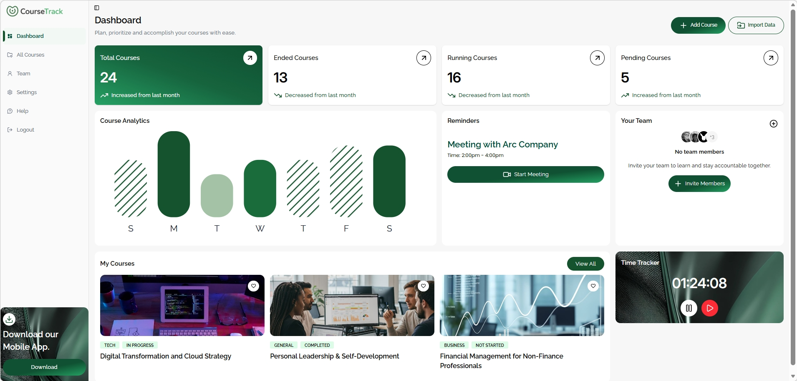
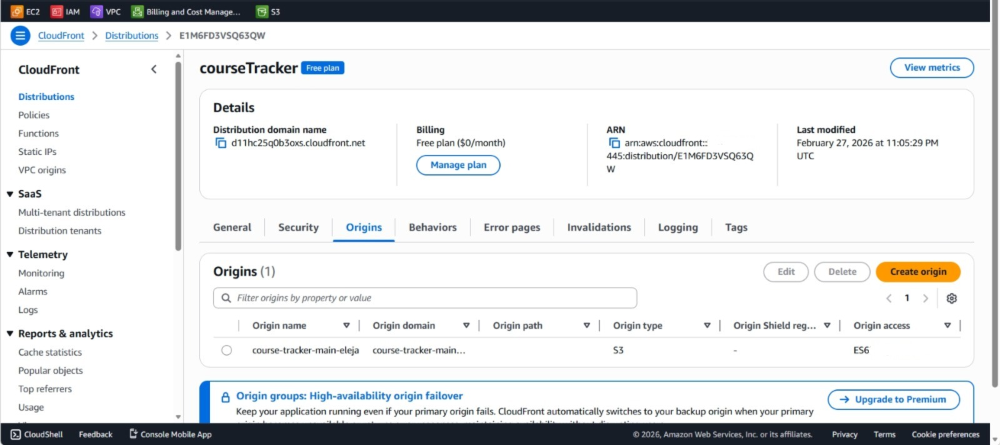
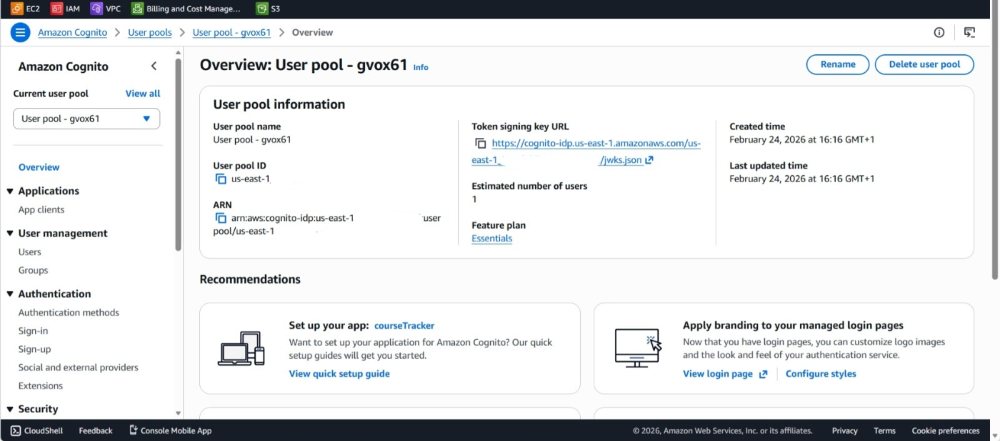
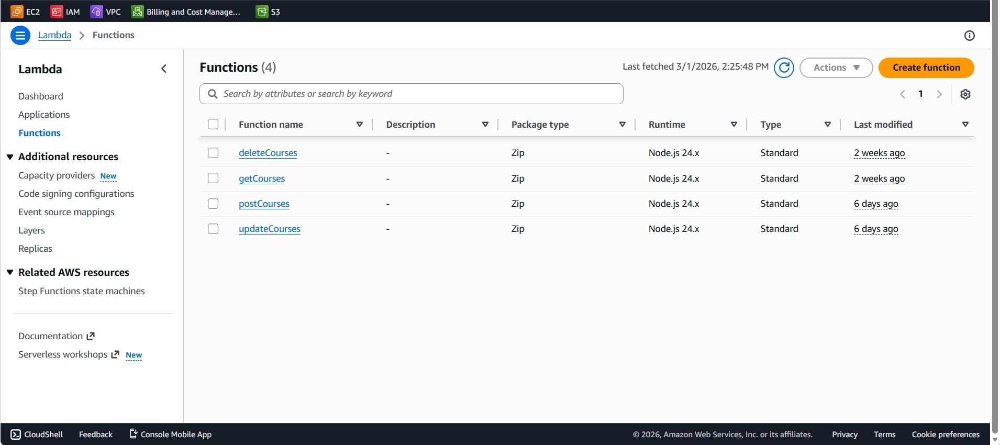
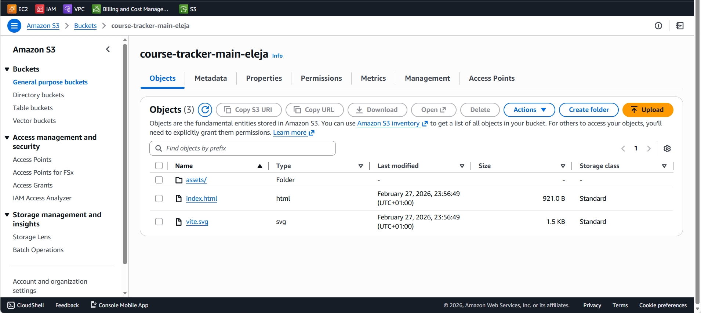

# CourseTrack 📚

## Overview
A full-stack serverless course tracking app that helps users manage their learning journey, monitor progress, and stay organized — built on AWS.

## Live Demo
Live Demo: https://d11hc25q0b3oxs.cloudfront.net

## Architecture

## How it works

- User visits the app via CloudFront (CDN)
- CloudFront serves the React app from a private S3 bucket
- User logs in via AWS Cognito — receives a JWT token
- Frontend attaches the JWT token to every API request
- API Gateway validates the JWT with Cognito before allowing access
- Validated requests trigger the appropriate Lambda function (get / create / update / delete)
- Lambda reads/writes data to DynamoDB

## Tech Stack

- React + Vite	
- Tailwind CSS
- Amazon S3	
- Amazon CloudFront	
- Amazon Cognito	
- Amazon API Gateway	
- AWS Lambda
- Amazon DynamoDB

## Screenshots

### Homepage

### Dashboard

### Courses Page

### Login Page

### CloudFront Distribution

### API Gateway

### Cognito

### Lambda

### s3 Storage

## Features

- Cognito-based authentication (JWT)
- Protected HTTP API via API Gateway
- Serverless backend with Lambda
- DynamoDB-powered data storage
- CloudFront + private S3 hosting
- Full CRUD functionality
- Responsive dashboard UI

## Future Improvements

- Implement CI/CD pipeline using GitHub Actions.
- Add custom domain with AWS Route 53.
- Convert infrastructure to Infrastructure-as-Code (Terraform or AWS CDK).
- Add monitoring and alerts using CloudWatch Alarms.

## 👩🏽‍💻 Author

Eleja Ololade  